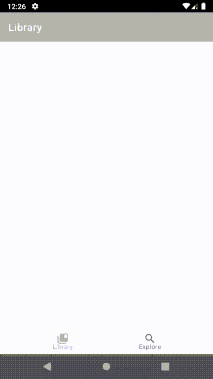

# Manga-Reader-Project
A <b>VERY</b> simple manga reader app made as a university project  
Fetches all info from https://api.mangadex.org REST API  
Uses <code>LiveData</code>, <code>Jetpack Navigation</code>, <code>Retrofit 2</code>, <code>Room</code> and <code>Coil</code>  
Features the MVVM architecture

Includes 4 fragments: <i>Library</i>, <i>Explore</i>, <i>Manga details</i> and <i>Reader</i>  
Titles can be favorited in <i>Explore</i>, which saves their reference to the Database which then can be viewed in <i>Library</i> fragment.

